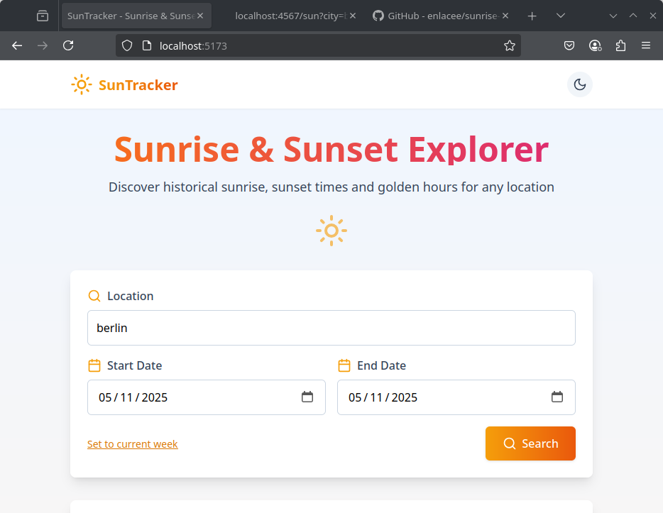
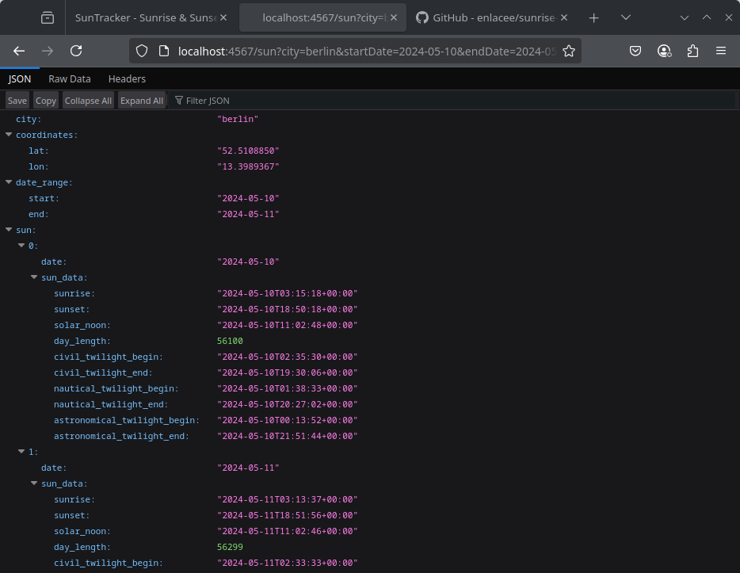

# 🌅 Sunrise Sunset App

Simple fullstack application to get sunrise and sunset times for a given location.

## 📦 Requirements

- Linux environment (tested on ArchLinux/Manjaro)
- Node.js (>= 20) & npm 
- Ruby (>= 3.0)

## 🚀 Frontend Installation

```
cd app-frontend
npm install
npm run dev
```

Visit: `http://localhost:5173/`

## 🌐 Backend Installation

```
cd app-backend
bundle install
ruby main.rb
```

Visit: `http://localhost:4567/`

## 📌 Notes

- Ruby dependencies are handled via Bundler (`Gemfile`)
- Use `.env` file to set environment variables if needed
- Sample API: `https://api.sunrise-sunset.org/json?lat=36.7201600&lng=-4.4203400`
    

## 🧪 Test API Endpoint

```
curl "http://localhost:4567/ping"
curl "http://localhost:4567/sun?city=berlin&startDate=2024-05-10&endDate=2024-05-11"
```

---


## Preview App






## Resources:

- [Requirements](./docs/Sunrise_Sunset_App.pdf)
- [Sunrise API](https://sunrise-sunset.org/api)